This tutorial provides a worked example of outbreak reconstruction using
*outbreaker2*. For installation guidelines, a general overview of the package's
functionalities as well as other resources, see the 'overview' vignette:

```r
vignette("Overview", package = "outbreaker2")
```

We will be analysing a small simulated outbreak distributed with the package,
`fake_outbreak`. This dataset contains simulated dates of onsets and pathogen
genome sequences for 30 cases:


```r
library(ape)
library(outbreaker2)

col <- "#6666cc"
fake_outbreak
#> $onset
#>  [1]  0  2  4  4  6  6  6  7  7  8  8  8  8  9  9  9  9 10 10 10 10 10 10
#> [24] 10 10 10 10 10 11 11
#> 
#> $sample
#>  [1]  3  5  6  6  7  9  8  9  9  9 11 10 10 10 10 11 11 12 11 13 12 13 11
#> [24] 12 11 11 13 12 14 14
#> 
#> $dna
#> 30 DNA sequences in binary format stored in a matrix.
#> 
#> All sequences of same length: 10000 
#> 
#> Labels:  ...
#> 
#> Base composition:
#>     a     c     g     t 
#> 0.251 0.242 0.251 0.256 
#> 
#> $w
#> [1] 0.10 0.50 1.00 0.75
#> 
#> $ances
#>  [1] NA  1  2 NA  3  4  4  5  6  6  7  8  9  5  5  7  7  8  9 10 11 11 13
#> [24] 13 13 17 17 NA 10 13
```

Here, we will use the dates of case isolation `$sample`, DNA sequences `$dna`, and the empirical distribution of the generation time `$w`, which can be visualised as:

```r

plot(fake_outbreak$w, type = "h", xlim = c(0, 5), 
     lwd = 30, col = col, lend = 2, 
     xlab = "Days after infection", 
     ylab = "p(new case)", 
     main = "Generation time distribution")
```

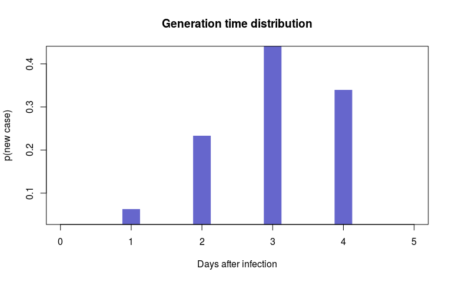


<br>

# Running the analysis with defaults

By default, *outbreaker2* uses the settings defined by `create_config()`; see
the documentation of this function for details. Note that the main function of
*outbreaker2* is called `outbreaker` (without number). The function's arguments are:


```r
args(outbreaker)
#> function (data = outbreaker_data(), config = create_config(), 
#>     priors = custom_priors(), likelihoods = custom_likelihoods(), 
#>     moves = custom_moves()) 
#> NULL
```

The only mandatory input really is the data. For most cases, customising the
method will be done through `config` and the function `create_config()`, which
creates default and alters settings such as prior parameters, length and rate of
sampling from the MCMC, and definition of which parameters should be estimated
('moved'). The last arguments of `outbreaker` are used to specify custom prior,
likelihood, and movement functions, and are detailed in the '*Customisation*'
vignette.


Let us run the analysis with default settings:


```r

dna <- fake_outbreak$dna
dates <- fake_outbreak$sample
w <- fake_outbreak$w
data <- outbreaker_data(dna = dna, dates = dates, w_dens = w)

## we set the seed to ensure results won't change
set.seed(1)


res <- outbreaker(data = data)
```

This analysis will take around 40 seconds on a modern computer. Note that
*outbreaker2* is slower than *outbreaker* for the same number of iterations, but
the two implementations are actually different. In particular, *outbreaker2*
performs many more moves than the original package for each iteration of the
MCMC, resulting in more efficient mixing. In short: *outbreaker2* is slower, but
it requires far less iterations.


Results are stored in a `data.frame` with the special class `outbreaker_chains`:

```r

class(res)
#> [1] "outbreaker_chains" "data.frame"
dim(res)
#> [1] 201  98
res
#> 
#> 
#>  ///// outbreaker results ///
#> 
#> class:  outbreaker_chains data.frame
#> dimensions 201 rows,  98 columns
#> ancestries not shown: alpha.1 - alpha.30
#> infection dates not shown: t_inf.1 - t_inf.30
#> intermediate generations not shown: kappa.1 - kappa.30
#> 
#> /// head //
#>   step       post       like    prior           mu        pi eps lambda
#> 1    1 -1107.0523 -1115.2144 8.162096 1.000000e-04 0.9000000 0.5   0.05
#> 2   50  -647.9528  -651.3690 3.416238 5.150148e-05 0.5283128 0.5   0.05
#> 3  100  -643.1737  -644.5943 1.420567 4.961035e-05 0.4231544 0.5   0.05
#> 
#> ...
#> /// tail //
#>      step      post      like    prior           mu        pi eps lambda
#> 199  9900 -558.0773 -564.1382 6.060963 7.321199e-05 0.7104930 0.5   0.05
#> 200  9950 -604.7960 -607.2165 2.420467 6.082569e-05 0.4734675 0.5   0.05
#> 201 10000 -543.9164 -549.2541 5.337745 1.019768e-04 0.6577321 0.5   0.05
```

Each row of `res` contains a sample from the MCMC. For each, informations about
the step (iteration of the MCMC), log-values of posterior, likelihood and
priors, and all parameters and augmented data are returned. Ancestries
(i.e. indices of the most recent ancestral case for a given case), are indicated
by `alpha.[index of the case]`, dates of infections by `t_inf.[index of the
case]`, and number of generations between cases and their infector / ancestor by
`kappa.[index of the case]`:


```r

names(res)
#>  [1] "step"     "post"     "like"     "prior"    "mu"       "pi"      
#>  [7] "eps"      "lambda"   "alpha.1"  "alpha.2"  "alpha.3"  "alpha.4" 
#> [13] "alpha.5"  "alpha.6"  "alpha.7"  "alpha.8"  "alpha.9"  "alpha.10"
#> [19] "alpha.11" "alpha.12" "alpha.13" "alpha.14" "alpha.15" "alpha.16"
#> [25] "alpha.17" "alpha.18" "alpha.19" "alpha.20" "alpha.21" "alpha.22"
#> [31] "alpha.23" "alpha.24" "alpha.25" "alpha.26" "alpha.27" "alpha.28"
#> [37] "alpha.29" "alpha.30" "t_inf.1"  "t_inf.2"  "t_inf.3"  "t_inf.4" 
#> [43] "t_inf.5"  "t_inf.6"  "t_inf.7"  "t_inf.8"  "t_inf.9"  "t_inf.10"
#> [49] "t_inf.11" "t_inf.12" "t_inf.13" "t_inf.14" "t_inf.15" "t_inf.16"
#> [55] "t_inf.17" "t_inf.18" "t_inf.19" "t_inf.20" "t_inf.21" "t_inf.22"
#> [61] "t_inf.23" "t_inf.24" "t_inf.25" "t_inf.26" "t_inf.27" "t_inf.28"
#> [67] "t_inf.29" "t_inf.30" "kappa.1"  "kappa.2"  "kappa.3"  "kappa.4" 
#> [73] "kappa.5"  "kappa.6"  "kappa.7"  "kappa.8"  "kappa.9"  "kappa.10"
#> [79] "kappa.11" "kappa.12" "kappa.13" "kappa.14" "kappa.15" "kappa.16"
#> [85] "kappa.17" "kappa.18" "kappa.19" "kappa.20" "kappa.21" "kappa.22"
#> [91] "kappa.23" "kappa.24" "kappa.25" "kappa.26" "kappa.27" "kappa.28"
#> [97] "kappa.29" "kappa.30"
```


<br>

# Analysing the results

## Graphics 

Results can be visualised using `plot`, which has several options and can be
used to derive various kinds of graphics (see `?plot.outbreaker_chains`).  The
basic plot shows the trace of the log-posterior values, which is useful to
assess mixing:


```r

plot(res)
```

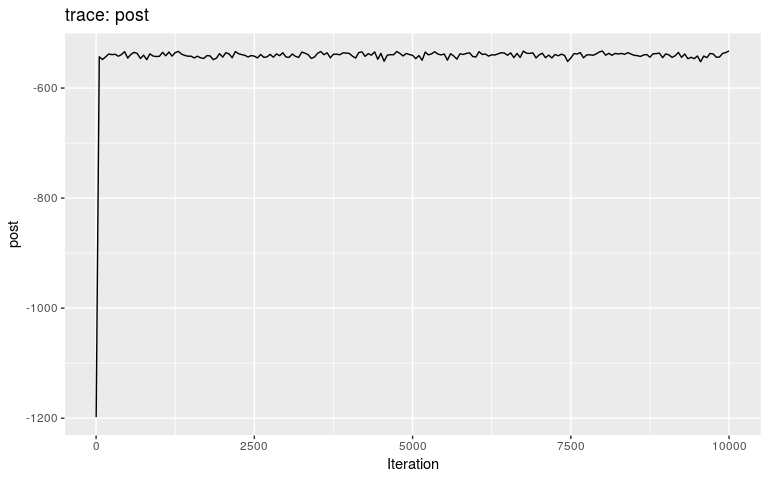

The second argument of `plot` can be used to visualise traces of any
other column in `res`:


```r

plot(res, "prior")
```

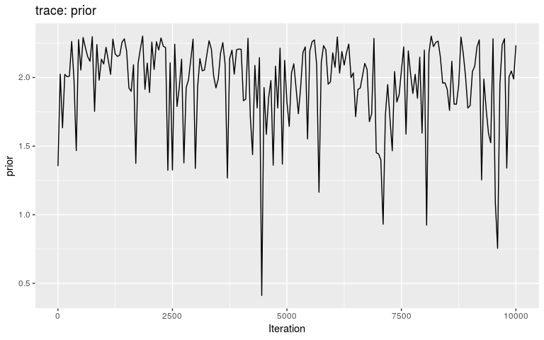

```r
plot(res, "mu")
```


```r
plot(res, "mu")
```

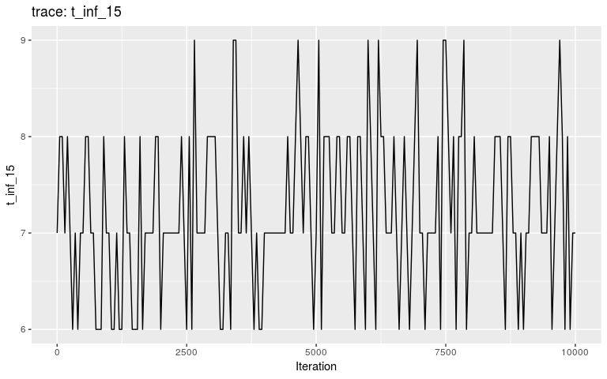

```r
plot(res, "t_inf.15")
```

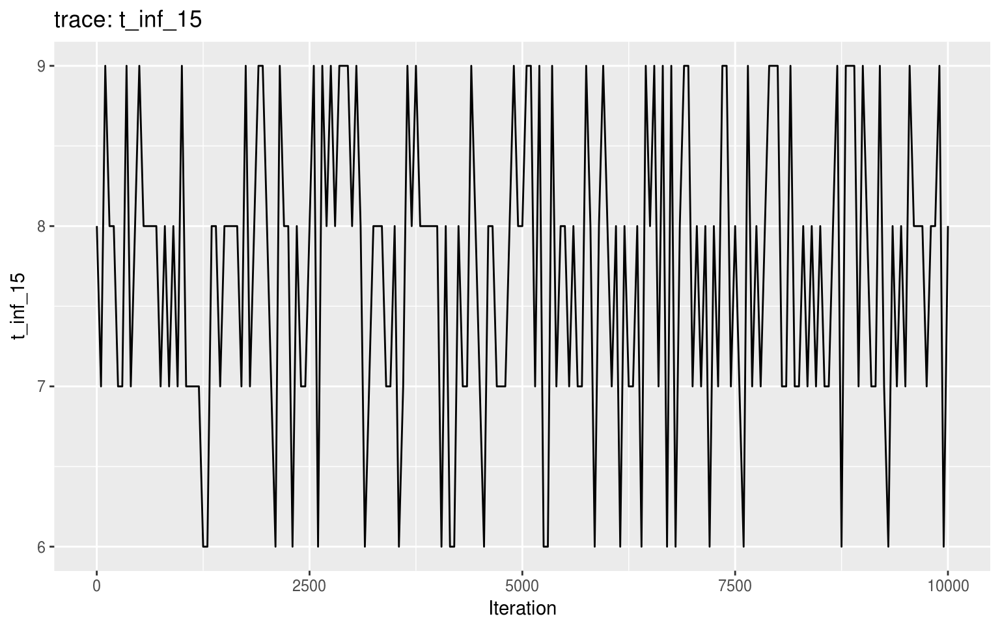

`burnin` can be used to discard the first iterations prior to mixing:


```r

## compare this to plot(res)
plot(res, burnin = 500)
```

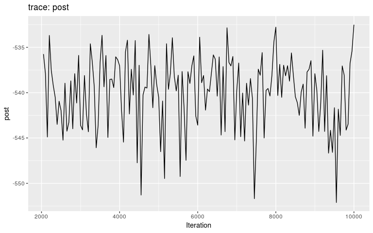

`type` indicates the type of graphic to plot; roughly:

- `trace` for traces of the MCMC (default)

- `hist`, `density` to assess distributions of quantitative values

- `alpha`, `network` to visualise ancestries / transmission tree; note that
  `network` opens up an interactive plot and requires a web browser with
  Javascript enabled; the argument `min_support` is useful to select only the
  most supported ancestries and avoid displaying too many links

- `kappa` to visualise the distributions generations between cases and their
  ancestor / infector

Here are a few examples:


```r

plot(res, "mu", "hist", burnin = 500)
#> `stat_bin()` using `bins = 30`. Pick better value with `binwidth`.
```

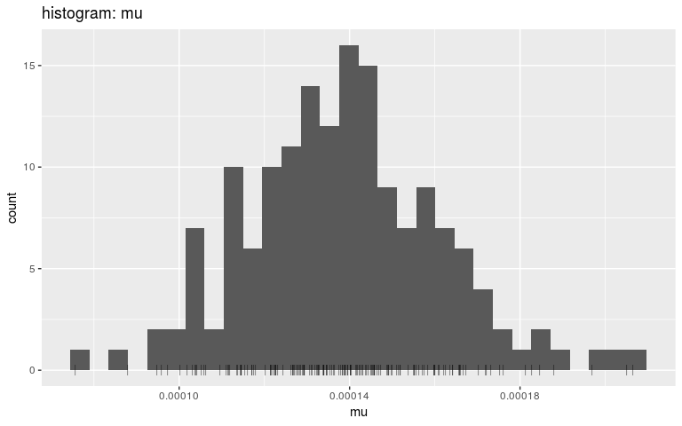

```r

plot(res, "mu", "density", burnin = 500)
```


```r

plot(res, type = "alpha", burnin = 500)
#> Warning: Removed 570 rows containing missing values (geom_point).
```

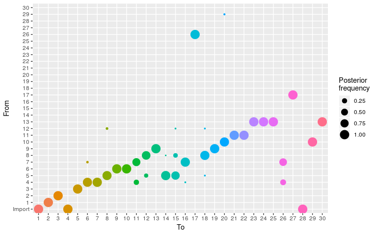

```r

plot(res, type = "t_inf", burnin = 500)
```

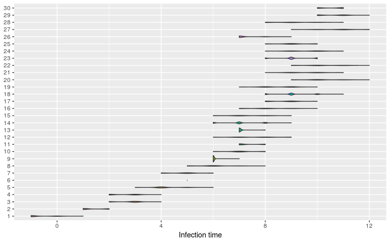

```r

plot(res, type = "kappa", burnin = 500)
#> Warning: Removed 570 rows containing missing values (geom_point).
```

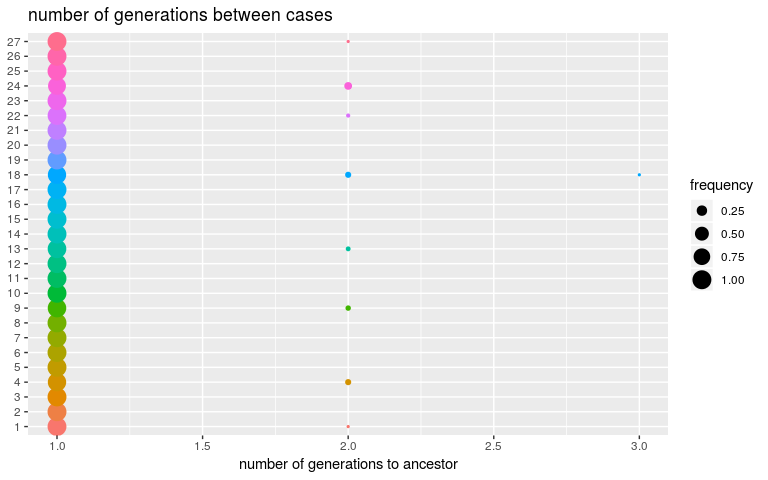

```r

plot(res, type = "network", burnin = 500, min_support = 0.01)
#> Error in loadNamespace(name): there is no package called 'webshot'
```


## Using `summary`

The summary of results derives various distributional statistics for posterior,
likelihood and prior densities, as well as for the quantitative parameters. It
also builds a consensus tree, by finding for each case the most frequent
infector / ancestor in the posterior samples. The corresponding frequencies are
reported as 'support'. The most frequent value of kappa is also reported as 'generations':


```r

summary(res)
#> $step
#>    first     last interval  n_steps 
#>        1    10000       50      201 
#> 
#> $post
#>    Min. 1st Qu.  Median    Mean 3rd Qu.    Max. 
#> -1107.0  -606.0  -585.9  -587.0  -567.5  -428.0 
#> 
#> $like
#>    Min. 1st Qu.  Median    Mean 3rd Qu.    Max. 
#> -1115.0  -608.6  -588.7  -590.2  -571.1  -436.9 
#> 
#> $prior
#>    Min. 1st Qu.  Median    Mean 3rd Qu.    Max. 
#>  -0.698   2.174   3.242   3.216   4.037   8.985 
#> 
#> $mu
#>      Min.   1st Qu.    Median      Mean   3rd Qu.      Max. 
#> 3.188e-05 5.307e-05 6.276e-05 6.280e-05 7.057e-05 1.404e-04 
#> 
#> $pi
#>    Min. 1st Qu.  Median    Mean 3rd Qu.    Max. 
#>  0.3352  0.4606  0.5183  0.5249  0.5671  0.9906 
#> 
#> $tree
#>    from to time   support generations
#> 1    NA  1   -1        NA          NA
#> 2     1  2    1 1.0000000           1
#> 3     2  3    2 0.9950249           1
#> 4    NA  4    2        NA          NA
#> 5     3  5    4 0.9651741           1
#> 6     4  6    5 0.9104478           1
#> 7     4  7    5 1.0000000           1
#> 8     5  8    6 0.9452736           1
#> 9     6  9    6 0.8955224           1
#> 10    6 10    7 0.9950249           1
#> 11    4 11    7 0.6815920           2
#> 12    5 12    7 0.8706468           2
#> 13    9 13    7 1.0000000           2
#> 14    5 14    8 0.8358209           2
#> 15    5 15    8 0.8457711           2
#> 16    4 16    8 0.5671642           2
#> 17    4 17    7 0.8258706           2
#> 18    5 18    9 0.6119403           3
#> 19    9 19    9 0.9950249           3
#> 20   10 20   11 0.9950249           3
#> 21   11 21   10 0.9701493           2
#> 22   11 22   11 0.9900498           3
#> 23   13 23    9 1.0000000           3
#> 24   13 24   10 1.0000000           3
#> 25   13 25    9 1.0000000           3
#> 26   17 26    9 0.9452736           3
#> 27   17 27   11 0.9651741           3
#> 28   NA 28    9        NA          NA
#> 29   10 29   12 1.0000000           3
#> 30   13 30   12 0.9950249           3
```


<br>

# Customising settings and priors

As said before, most customisation can be achieved via `create_config`.
In the following, we make the following changes to the defaults:

- increase the number of iterations to 20,000

- set the sampling rate to 20

- use a star-like initial tree

- disable to movement of `kappa`, so that we assume that all cases have
  observed; accordingly we also set the initial value of `pi` to 1 and disable
  this move

- set a lower rate for the exponential prior of `mu` (10 instead of 1000)


```r

config2 <- create_config(n_iter = 2e4,
                        sample_every = 20,
			init_tree ="star",
			move_kappa = FALSE,
			init_pi =1,
			move_pi = FALSE,
			prior_mu = 10)

set.seed(1)

res2 <- outbreaker(data, config2)
plot(res2)
```

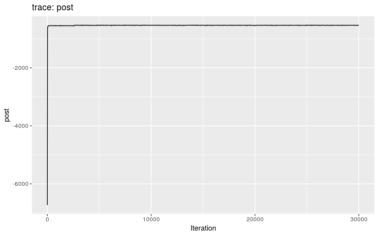

```r
plot(res2, burn = 500)
```

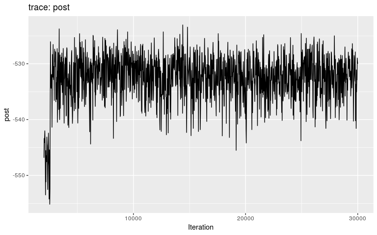

We can see that the burnin is around 3,000 iterations (i.e. after the initial
step corresponding to a local optimum).  We get the consensus tree from the new
results, and compare the inferred tree to the actual ancestries stored in the
dataset (`fake_outbreak$ances`):

```r

summary(res2, burnin = 4000)
#> $step
#>    first     last interval  n_steps 
#>     4020    20000       20      800 
#> 
#> $post
#>    Min. 1st Qu.  Median    Mean 3rd Qu.    Max. 
#>  -483.7  -470.7  -468.6  -468.8  -466.5  -460.9 
#> 
#> $like
#>    Min. 1st Qu.  Median    Mean 3rd Qu.    Max. 
#>  -488.3  -475.3  -473.2  -473.4  -471.1  -465.5 
#> 
#> $prior
#>    Min. 1st Qu.  Median    Mean 3rd Qu.    Max. 
#>   4.603   4.603   4.604   4.604   4.604   4.604 
#> 
#> $mu
#>      Min.   1st Qu.    Median      Mean   3rd Qu.      Max. 
#> 9.399e-05 1.357e-04 1.500e-04 1.521e-04 1.676e-04 2.253e-04 
#> 
#> $pi
#>    Min. 1st Qu.  Median    Mean 3rd Qu.    Max. 
#>       1       1       1       1       1       1 
#> 
#> $tree
#>    from to time support generations
#> 1    NA  1   -1      NA          NA
#> 2     1  2    1 1.00000           1
#> 3     2  3    3 1.00000           1
#> 4    NA  4    3      NA          NA
#> 5     3  5    4 0.97750           1
#> 6     9  6    6 0.99750           1
#> 7     4  7    5 1.00000           1
#> 8     5  8    6 0.95875           1
#> 9     4  9    5 0.96250           1
#> 10    6 10    8 1.00000           1
#> 11    7 11    7 0.69125           1
#> 12    5 12    7 0.83250           1
#> 13    9 13    7 1.00000           1
#> 14    5 14    7 0.73125           1
#> 15    5 15    7 0.73375           1
#> 16    7 16    8 0.79625           1
#> 17   26 17    9 1.00000           1
#> 18    8 18    9 0.46250           1
#> 19    9 19    8 1.00000           1
#> 20   10 20   10 0.97750           1
#> 21   11 21   10 0.97875           1
#> 22   11 22   10 1.00000           1
#> 23   13 23    9 1.00000           1
#> 24   13 24    9 1.00000           1
#> 25   13 25    9 1.00000           1
#> 26    7 26    7 0.69500           1
#> 27   17 27   11 1.00000           1
#> 28   NA 28    9      NA          NA
#> 29   10 29   11 1.00000           1
#> 30   13 30   10 1.00000           1
tree2 <- summary(res2, burnin = 4000)$tree

comparison <- data.frame(case = 1:30,
                       	 inferred = paste(tree2$from),
			 true = paste(fake_outbreak$ances))
			 
comparison$correct <- with(comparison, inferred==true)			   
#> Error in Ops.factor(inferred, true): level sets of factors are different
comparison
#>    case inferred true
#> 1     1       NA   NA
#> 2     2        1    1
#> 3     3        2    2
#> 4     4       NA   NA
#> 5     5        3    3
#> 6     6        9    4
#> 7     7        4    4
#> 8     8        5    5
#> 9     9        4    6
#> 10   10        6    6
#> 11   11        7    7
#> 12   12        5    8
#> 13   13        9    9
#> 14   14        5    5
#> 15   15        5    5
#> 16   16        7    7
#> 17   17       26    7
#> 18   18        8    8
#> 19   19        9    9
#> 20   20       10   10
#> 21   21       11   11
#> 22   22       11   11
#> 23   23       13   13
#> 24   24       13   13
#> 25   25       13   13
#> 26   26        7   17
#> 27   27       17   17
#> 28   28       NA   NA
#> 29   29       10   10
#> 30   30       13   13
```

The consensus tree is near perfect. Let's visualise the posterior trees:


```r

plot(res2, type = "network", burnin = 4000, min_support = 0.01)
#> Error in loadNamespace(name): there is no package called 'webshot'
```
